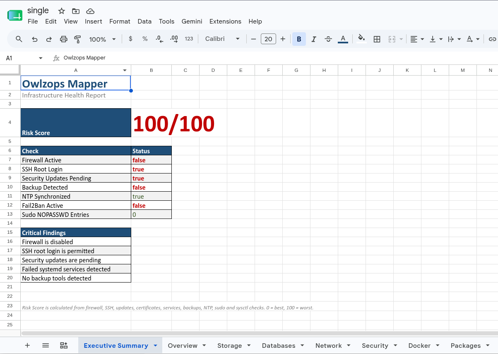
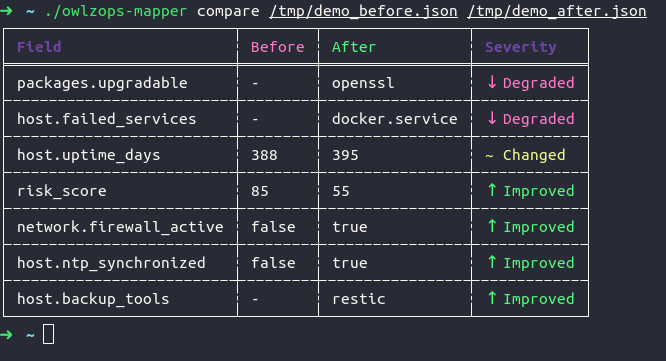

# owlzops-mapper
[](https://github.com/OWLZOPS/owlzops-mapper/actions/workflows/ci.yml)
[](https://github.com/OWLZOPS/owlzops-mapper/releases)
[](LICENSE)

> One binary. One command. Full picture of your server – now with **Risk Score**, **multi‑host remote audit**, **snapshot diff** and **drift monitoring**.

**owlzops-mapper** is a self-contained Rust binary that performs a complete
Linux server audit in seconds and exports the result to Excel, JSON or
terminal. No internet required. No data leaves the server.

For sysadmins it's instant inventory. For CTOs it's technical debt visibility. For CEOs it's
risk and cost optimization.

## Why does this exist?

Most infrastructure scanners require agents, Python runtimes, or open
firewall ports. This one doesn't. It's a static Rust binary that does
everything locally and exits. I built it because I was tired of manually
checking server configurations during audits - and I wanted a tool that
could diff snapshots over time, so I could see exactly what changed and
when.

---

## Quick Start

**Option 1 – direct download:**
```bash
curl -L https://github.com/OWLZOPS/owlzops-mapper/releases/latest/download/owlzops-mapper-linux-x86_64.tar.gz | tar xz
sudo ./owlzops-mapper audit
```

**Option 2 – install script (verifies SHA256 + GPG):**
```bash
curl -sSL https://raw.githubusercontent.com/OWLZOPS/owlzops-mapper/main/install.sh | sh
sudo ./owlzops-mapper audit
```

---

## Core Features

- **Multi‑host remote audit** – scan dozens of servers over SSH in parallel, with automatic binary deployment and concurrency limits. Supports both passwordless sudo and **password‑based sudo** (`‑‑ask‑sudo‑pass`) — no pre‑configured `NOPASSWD` required.
- **Snapshot diff & drift monitoring** – capture server state as JSON snapshots, compare any two, and get colour‑coded Excel/terminal diffs of exactly what changed.
- **Context‑aware Risk Score** – findings are evaluated with awareness of the environment (e.g., Docker/kubelet hosts are not penalised for `ip_forward=1`). Sub‑scores for Security, Reliability and Hygiene prevent score saturation.
- **Deep Docker & container audit** – detects privileged containers, missing memory/CPU limits, sensitive host mounts, OOM‑killed containers, restart loops, and unhealthy healthchecks. All with CIS references.
- **CIS Benchmark mapping** – every security finding includes a reference to the corresponding CIS Benchmark rule (e.g., `CIS 5.2.10`), ready for compliance audits.
- **Agentless & air‑gapped** – a single static binary with no runtime dependencies; `--offline` mode guarantees zero outbound calls for restricted environments.
- **Rich Excel & terminal output** – dashboard‑style terminal report plus professional Excel workbooks with Executive Summary, per‑host sheets, and colour‑coded comparisons.
---

## Highlights v0.5.2 (async SSH + Docker audit)

- **Async SSH engine (`russh`)** – fleet scans now support `--ask-sudo-pass` to authenticate via password without pre‑configuring `NOPASSWD` on every host. Known‑hosts TOFU verification with warnings.
- **Progress bar for `--copy-binary`** – binary uploads show a real‑time progress bar with file size and ETA, in both legacy and async SSH paths.
- **Docker reliability findings** – OOM‑killed containers, restart loops, and unhealthy healthchecks are now detected and scored under the Reliability category (`DOCK‑007…DOCK‑009`).
- **Sensitive mount detection** – containers mounting the Docker socket, host root, or writable sensitive directories are flagged as high‑risk (`DOCK‑005`, `DOCK‑006`) with CIS references.
- **Scoring version guard** – `risk_score` differences caused by formula updates are now marked as `Changed` instead of false improvements/degradations, preserving drift accuracy in `compare`.
- **Compare v2** – metadata header with hostname, timestamps, binary version and time span; deterministic diff order; multi‑host summary with Added/Removed/Compared statuses.
- **UX polish** – `--keep-binary` flag to skip cleanup after remote scan; emojis and ANSI colours are automatically disabled when stdout is piped; `--max-concurrent` controls fleet parallelism; file descriptor limit raised automatically.

---

<details>
<summary>Previous releases (v0.5.1, v0.5.0, v0.4.11, v0.4.10)</summary>

## Highlights v0.5.1 (compare v2)

- **Rich diff metadata** – terminal and Excel diffs now show hostname, timestamps, binary version, and time span between snapshots.
- **Scoring version guard** – `risk_score` changes across different scoring engine versions are marked as `Changed`, preventing false drift.
- **Deterministic diff order** – byte‑identical reports for the same snapshots, safe for version control.
- **Multi‑host summary** – fleet diffs show summary line and status tags (`[+ added]`, `[− removed]`).
- **Extended SSL tracking** – warning‑level expiry and newly added certificates are detected.
- **Port diff optimization** – zero‑copy O(n) comparison.

## Highlights v0.5.0

- **Context‑aware scoring** – `ip_forward` and `suid_dumpable` are no longer flagged on Docker/kubelet hosts or when systemd‑coredump is active.
- **Graduated weights** – SSH `PermitRootLogin` differentiates `prohibit‑password`; security updates are tiered; sudo `NOPASSWD` distinguishes `ALL` from restricted commands.
- **Docker security findings** – containers missing memory/CPU limits, privileged mode, and dangerous capabilities now directly affect Risk Score.
- **CIS Benchmark references** – every finding includes a CIS reference (e.g., `CIS 5.2.10`) for immediate audit compliance mapping.
- **Sub‑scores** – Security, Reliability, and Hygiene now have individual caps (60/30/10), preventing score saturation and enabling drift visibility.
- **Transparent Breakdown** – the terminal dashboard now shows the exact active findings with weights and CIS tags.

## Changelog (v0.4.11)

- **Sysctl false positives fixed** – `fs.suid_dumpable` now accepts value `2` with piped `core_pattern` (systemd-coredump); `net.ipv4.ip_forward=1` is no longer flagged on Docker/kubelet hosts.
- **Snapshot directory respects original user** – when running under `sudo`, snapshots now save to `$SUDO_USER`'s home directory instead of `/root`.
- **Documentation improvements** – added Core Features section, demo screenshots for Excel report and snapshot diff, corrected CLI flag name.
- **Miscellaneous hardening** – final round of code-quality fixes from the v0.4.10 audit (async consistency, timeout caps, test coverage).

## Changelog (v0.4.10)

- **Remote pipe‑deadlock fixed** – SSH scans producing reports larger than 64 KB no longer hang; stdout/stderr are now drained in parallel threads.
- **Accurate package counts on RPM systems** – `installed_count` now uses `rpm -qa` instead of broken `dnf -qa`, which silently returned fake numbers.
- **Honest exit codes for fleet scans** – a fleet scan where all hosts fail now returns exit code 2 instead of a false‑positive 0.
- **JSON export respects `--output`** – the `--output` flag is now honoured for JSON format, and export errors are properly propagated to the exit code.
- **Database size measurement no longer silently returns 0 GB** – `du` timeout increased to 60 s, avoiding false zero sizes on large data directories.
- **NTP offset extraction from systemd‑timesyncd** – actual time synchronisation offset is now shown instead of a blank field on many Linux distributions.
- **More robust SSH config parsing** – the fallback parser now follows first‑match semantics, ignores conditional `Match` blocks, and is case‑insensitive.
- **Sudo self‑exclusion tightened** – only canonical binary paths are excluded from the NOPASSWD audit, preventing accidental blind spots.
- **Miscellaneous hardening** – `df -P` output stability, external IP validation, removal of a double sysinfo refresh, dynamic remote timeout cap, and `saturating_mul` for risk scores.

</details>

---

## Usage

### Local audit
```bash
# Terminal dashboard (default, fully offline)
sudo ./owlzops-mapper audit

# Export to Excel (with Executive Summary as first sheet)
sudo ./owlzops-mapper audit --format excel --output report.xlsx
```



```bash
# JSON for programmatic use
sudo ./owlzops-mapper audit --format json > snapshot.json

# Detect external IP (opt-in outbound request)
sudo ./owlzops-mapper audit --external-ip

# Refresh package cache before checking updates
sudo ./owlzops-mapper audit --refresh-packages

# Air-gapped / restricted network — guarantees zero outbound calls
sudo ./owlzops-mapper audit --offline
```

### Remote audit (via SSH)
```bash
# Scan a single remote host (binary must be present at /tmp/owlzops-mapper;
# the remote user needs passwordless sudo permission for the binary path).
sudo ./owlzops-mapper audit --host 192.168.1.10 --ssh-user operator
```


```bash
# Scan multiple comma-separated hosts
sudo ./owlzops-mapper audit --host 192.168.1.10,192.168.1.11 --ssh-user operator

# Automatically copy the local static binary to the remote host first.
# Release binaries are static (musl), so --copy-binary works out of the box.
sudo ./owlzops-mapper audit --host 192.168.1.10 --ssh-user operator --copy-binary

# If you built your own binary (e.g. debug build), point to the musl release:
sudo ./owlzops-mapper audit --host 192.168.1.10 --ssh-user operator --copy-binary \
  --local-binary target/x86_64-unknown-linux-musl/release/owlzops-mapper

# Scan multiple hosts from a file (one per line)
sudo ./owlzops-mapper audit --hosts hosts.txt --ssh-user operator --copy-binary

# Multi-host Excel report with one sheet per host
sudo ./owlzops-mapper audit --hosts hosts.txt --ssh-user operator --format excel --output fleet-audit.xlsx
```

### Fleet scan: 20+ VPS in one command

1. Create a `hosts.txt` file (one host per line):
   ```
   10.0.0.1
   10.0.0.2
   ...
   10.0.0.20
   ```

2. **Authentication – choose the method that fits your environment:**

   **Option A (passwordless, legacy)**
   Bake this line into cloud‑init / Terraform once per host:
   ```bash
   echo "ubuntu ALL=(ALL) NOPASSWD: /tmp/owlzops-mapper" | sudo tee /etc/sudoers.d/owlzops
   ```
   Then run the fleet scan **without** `‑‑ask‑sudo‑pass`.

   **Option B (interactive password, new in v0.5.2)**
   No sudoers changes needed – you only need regular `sudo` access.
   The mapper will ask for your password once and forward it securely over
   the SSH channel (`sudo -S`).  Just add `‑‑ask‑sudo‑pass` to the command
   below.

3. Run the audit from your local machine – the binary copies itself,
   scans all 20 servers in parallel, and cleans up automatically:
   ```bash
   sudo ./owlzops-mapper audit \
     --hosts hosts.txt \
     --ssh-user ubuntu \
     --copy-binary \
     --ask-sudo-pass \
     --format excel \
     --output fleet-report.xlsx
   ```

Under the hood, `owlzops-mapper` connects to every server via SSH,
uploads itself to `/tmp/owlzops-mapper`, executes the audit, collects
the JSON results, removes the binary from each host, and produces a
single multi‑sheet Excel report.  No agent installation, no open ports
beyond SSH.

### Snapshotting & drift monitoring
```bash
# Save a timestamped JSON snapshot (default directory: ~/.owlzops/snapshots/<hostname>/)
sudo ./owlzops-mapper snapshot

# Specify custom output directory
sudo ./owlzops-mapper snapshot --output-dir /var/lib/owlzops

# Compare the two most recent snapshots for a host
./owlzops-mapper dir-compare ~/.owlzops/snapshots/ubuntu

# Export that comparison to Excel
./owlzops-mapper dir-compare --format excel --output drift.xlsx ~/.owlzops/snapshots/ubuntu
```

### Comparing snapshots (diff)



*Demo: a before/after comparison with metadata header showing host, timestamps, binary version, and time span.*

```bash
# Compare two JSON snapshots in terminal (colored table)
./owlzops-mapper compare before.json after.json

# Output includes metadata header:
#   host:    owl1.owlzops.com
#   before: 2026-07-05 17:41 UTC  (v0.5.0, risk 55)
#   after:  2026-07-05 17:42 UTC  (v0.5.0, risk 45)
#   span:   1m

# Export diff to JSON
./owlzops-mapper compare before.json after.json --format json > diff.json

# Export diff to Excel (color-coded: green=improved, red=degraded, yellow=changed)
./owlzops-mapper compare before.json after.json --format excel --output diff.xlsx

# Multi‑host comparison: both files must be arrays of host reports (e.g., from a fleet scan)
./owlzops-mapper compare --multi-host fleet_before.json fleet_after.json
```

---

## Command-Line Options

| Flag | Description |
|------|-------------|
| `-f, --format` | Output format: `text` (default), `json`, `xlsx` (or `excel`) |
| `-o, --output` | Output file for Excel reports (default: `owlzops-report-<hostname>-YYYY-MM-DD_HH-MM-SS.xlsx`) |
| `--external-ip` | Fetch public IP via outbound request (off by default) |
| `--refresh-packages` | Update package cache before scanning (off by default) |
| `--offline` | Disable **all** network calls. Overrides other flags if combined |
| `--host <HOST>` | Single hostname/IP (or comma‑separated list) for remote scanning |
| `--hosts <FILE>` | File with one hostname/IP per line for remote scanning |
| `--ssh-user <USER>` | SSH user for remote connections (default: `root`; prefer a non‑root user with passwordless sudo) |
| `--ssh-key <PATH>` | Path to SSH private key (default: `~/.ssh/id_rsa`) |
| `--copy-binary` | Copy the local binary to remote hosts before scanning. The binary **must** be statically linked (musl). GitHub release binaries are static, so you can safely use this flag with them. |
| `--local-binary <PATH>` | When using `--copy-binary`, path to a local static (musl) binary to copy instead of the currently running one. Useful if you're running a debug build locally but have a release build for remote hosts. |
| `--remote-path <PATH>` | Path where the binary is placed on remote hosts (default: `/tmp/owlzops-mapper`) |
| `--remote-timeout-secs <SECS>` | Maximum time to wait for remote scan (default: 120 seconds) |
| `--ask-sudo-pass` | Prompt for a sudo password and forward it securely over the SSH channel (removes the NOPASSWD requirement) |
| `--keep-binary` | Skip cleanup — leave the binary on the remote host after the scan |
| `--max-concurrent <N>` | Maximum number of simultaneous SSH sessions (default: 50) |
| `-h, --help` | Print help |
| `-V, --version` | Print version |

### Subcommands

| Command | Description |
|---------|-------------|
| `audit` | Run an audit scan (local or remote) |
| `snapshot` | Run an audit and save the JSON snapshot to disk |
| `compare <before> <after>` | Compare two JSON snapshots and show drift |
| `dir-compare <dir>` | Compare the two most recent snapshots in a directory |

---

## Exit Codes

| Code | Single Host | Multi-Host (Fleet) |
|------|-------------|---------------------|
| `0`  | No critical issues found | All hosts clean |
| `1`  | One or more critical findings (firewall disabled, SSH root login permitted, pending security updates, SSL certificate about to expire, failed services, missing backups, NTP not synced, sudo NOPASSWD entries, sysctl issues ≥ 3) | Any host has critical issues |
| `2`  | Not running as root, scan warnings present, **or fleet scan produced zero reports** | Any host not running as root, **or all remote hosts failed** |

> **Scoring version guard:** when comparing snapshots taken with different scoring engine versions, `risk_score` changes are marked as `~ Changed` rather than `↑ Improved` or `↓ Degraded`.

You can use these codes directly in CI/CD pipelines:
```bash
sudo ./owlzops-mapper audit || echo "Security scan failed – check the report"
```

---

## Risk Score

The dashboard and Excel report include a **Risk Score (0–100)** calculated
from real findings. The score is split into three sub‑scores:

| Category | Cap | Examples |
|---|---|---|
| **Security** | 60 | Firewall, SSH config, security updates, Docker risks, sysctl hardening |
| **Reliability** | 30 | Failed services, missing backups, OOM kills, container health |
| **Hygiene** | 10 | NTP synchronization |

Lower scores are better. Each finding is tagged with a CIS Benchmark reference where applicable.  
Colour legend: **green** < 40, **yellow** 40–69, **red** ≥ 70.

| Finding | Penalty |
|---|---|
| Firewall inactive | +30 |
| SSH root login allowed | +25 (`prohibit-password` reduces weight) |
| Pending security updates | +20 (stepped: 10/15/20 depending on count) |
| SSL certificate expires within 7 days | +15 (max) |
| Failed systemd services | +10 |
| SSH password authentication enabled | +10 |
| OOM kills present | +10 |
| No backup tools detected | +20 |
| NTP not synchronized | +10 |
| Sudo NOPASSWD entries found | +5 (restricted commands) / +15 (ALL) |
| Sudoers permissions not 0440 | +5 |
| Sysctl security issues | +5 per issue (context‑sensitive) |
| Docker: containers without memory limits | +5 |
| Docker: containers without CPU limits | +3 |
| Docker: privileged containers | +10 |
| Docker: dangerous capabilities | +10 |
| Root login with password (combo) | +5 |
| Container mounts Docker socket or host root | +15 |
| Container mounts sensitive host path (writable) | +10 |
| Docker: containers killed by OOM | +10 |
| Docker: containers in restart loop | +5 |
| Docker: unhealthy containers (failing healthcheck) | +10 |

---

## What It Scans

| Category | Details |
|---|---|
| System | OS, kernel, uptime, CPU, RAM, load average, LSM modules |
| Security | SSH config (effective and fallback), root login, password auth, users, authorized keys, login history, fail2ban & auditd presence, **sudo NOPASSWD entries, sudoers permissions, sysctl security audit** |
| Network | Listening ports with bind address (red = exposed on 0.0.0.0/::), firewall (ufw, firewalld, nftables, iptables), DNS, SSL certificates with expiry |
| Storage | Disk usage, inode usage per mount |
| Docker | Images, dangling layers, containers, mounts, log sizes, privileged flag, memory/CPU limits, dangerous capabilities, **sensitive host mounts, OOM kills, restart loops, health status** |
| Packages | Installed count, upgradable, security updates (apt/dnf/yum/pacman/zypper) |
| Databases | PostgreSQL, MySQL, Redis, MongoDB — versions and data sizes |
| Internals | Cron jobs, systemd timers, /etc/hosts overrides, kernel errors, failed systemd units |
| Backups | Detection of restic, borg, duplicati, rsync/backup in cron |
| NTP | Time synchronization status and offset |

---

## What do these findings mean?

Owlzops provides fixed-price engineering packages to fix the architectural issues discovered by this scanner.

| Finding | What it means | Recommended Next Step |
|---------|---------------|-----------------------|
| **Risk Score ≥ 70** | The infrastructure has systemic risks across multiple vectors. You need a comprehensive review. | [Infrastructure Healthcheck](https://owlzops.com/?utm_source=github&utm_medium=readme&utm_campaign=mapper_table#services:~:text=Infrastructure%20Healthcheck) |
| **No backup tools** | No automated backups or disaster recovery strategy detected. Data loss is just a matter of time. | [Production Reliability Sprint](https://owlzops.com/?utm_source=github&utm_medium=readme&utm_campaign=mapper_table#services:~:text=Production%20Reliability%20Sprint) |
| **Failed systemd / OOM kills** | Production stability is compromised. Services are crashing or starving for resources. | [Production Reliability Sprint](https://owlzops.com/?utm_source=github&utm_medium=readme&utm_campaign=mapper_table#services:~:text=Production%20Reliability%20Sprint) |
| **Security updates pending** | The system is accumulating technical debt and unpatched vulnerabilities. | [Reliability Retainer](https://owlzops.com/?utm_source=github&utm_medium=readme&utm_campaign=mapper_table#services:~:text=Reliability%20Retainer) |
| **Firewall disabled / SSH root** | Critical authentication weaknesses. The host is exposed to the public internet. | [Free Mapper Consultation](https://owlzops.com/contact?utm_source=github&utm_medium=readme&utm_campaign=mapper_table) |

If owlzops-mapper flagged critical issues, we can review your JSON report and provide a concrete remediation plan.

→ [Book a free 30-min infrastructure review](https://owlzops.com/contact?utm_source=github&utm_medium=readme&utm_campaign=mapper_table)

We review your scan before the call. No pitch - just facts.

---

## Why Rust?

Single static binary. No runtime, no Python, no dependencies to install on
the target server. Copy it, run it, done.

---

## Building from Source

```bash
git clone https://github.com/OWLZOPS/owlzops-mapper
cd owlzops-mapper
cargo build --release
sudo ./target/release/owlzops-mapper audit
```

For static musl build (recommended for remote scanning):
```bash
rustup target add x86_64-unknown-linux-musl
cargo build --release --target x86_64-unknown-linux-musl
```

Requires: Rust 1.85+, Linux target.

Our CI pipeline pins all GitHub Actions by commit SHA, includes `cargo audit`, `cargo deny`, and generates an SBOM on every release – see the [workflows](.github/workflows) for details.

---

## Verifying Releases

All release artifacts are GPG-signed and SHA256 checksums are published.
The project public key is [`gpg-public-key.asc`](gpg-public-key.asc).
To verify:

```bash
gpg --import gpg-public-key.asc
gpg --verify owlzops-mapper-linux-x86_64.tar.gz.asc owlzops-mapper-linux-x86_64.tar.gz
```

The install script (`install.sh`) now performs GPG verification automatically if `gpg` is available.

---

## License

**Apache-2.0 with Commons Clause** - free to use, not to resell.

**Is it free for my company?**
Yes. You are 100% free to use owlzops-mapper for commercial purposes, corporate infrastructure audits and internal security checks.

The Commons Clause simply prevents third parties from taking this codebase and directly reselling it as their own commercial software or SaaS product.
See [LICENSE](LICENSE) for details.
```